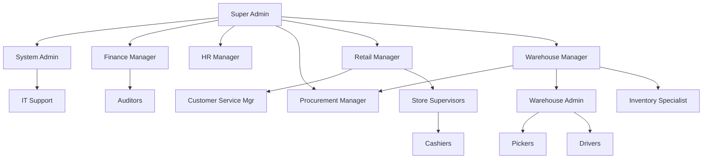

# Organizational Hierarchy & Role Access Control (RBAC)

This document outlines the hierarchical structure of the SIIFMART system, defining reporting lines, permissions, and role responsibilities.

## 👑 Level 1: Executive & System Administration
*The highest level of control, responsible for overall system integrity and business configuration.*

### **1. Super Admin** (`super_admin`)
- **Reports To:** Board of Directors / Owners
- **Scope:** Entire System (Global)
- **Responsibilities:**
  - Full access to ALL modules and data.
  - Can create/terminate System Admins and Department Heads.
  - Access to critical "Danger Zones" (System Reset, Database Wipes).
  - View all financial data (Profit/Loss, Salaries).
  - Final approval authority for all high-level decisions.

### **2. System Admin** (`admin`)
- **Reports To:** Super Admin
- **Scope:** Technical & System Configuration
- **Responsibilities:**
  - Manages system settings (Tax rates, Currencies, Integrations).
  - Oversees IT Support team.
  - Can create Managers and Operational Staff.
  - Technical troubleshooting and system maintenance.
  - **Restriction:** Cannot view sensitive HR salary data unless explicitly authorized.

---

## 👔 Level 2: Department Management
*Heads of specific business units. They manage strategy and people within their domain.*

### **3. Finance Manager** (`finance_manager`) **[NEW]**
- **Reports To:** Super Admin
- **Scope:** Financial Operations & Controls
- **Responsibilities:**
  - Approve expenses above threshold (e.g., >$5,000).
  - Manage budgets and financial forecasts.
  - Generate P&L, Cash Flow, and Balance Sheet reports.
  - Reconcile accounts and bank statements.
  - Oversee Auditors.
  - **Key Access:** Full financial data, expense approval, payroll review.

### **4. HR Manager** (`hr`)
- **Reports To:** Super Admin
- **Scope:** People Operations
- **Responsibilities:**
  - Full control over the **Employees** module.
  - Hiring, Onboarding, and Termination (with Admin approval for high-level staff).
  - Payroll processing and Leave management.
  - Performance reviews and training programs.
  - **Restriction:** Limited access to Inventory/Sales data (view-only).

### **5. Procurement Manager** (`procurement_manager`) **[NEW]**
- **Reports To:** Super Admin / Warehouse Manager
- **Scope:** Supply Chain & Vendor Management
- **Responsibilities:**
  - Negotiate contracts with suppliers.
  - Create and approve Purchase Orders.
  - Manage supplier relationships and ratings.
  - Monitor stock levels and set reorder points.
  - Optimize procurement costs.
  - **Key Access:** Full PO system, supplier management, inventory forecasting.

### **6. Retail Manager** (`manager` + Dept: Retail)
- **Reports To:** Super Admin
- **Scope:** Store Operations
- **Responsibilities:**
  - Oversees all Retail Stores and Store Supervisors.
  - Manages Store Supervisors and Cashiers.
  - View Sales Reports and Store Performance.
  - Can approve discounts and returns.
  - Set pricing and promotional strategies.

### **7. Warehouse Manager** (`manager` + Dept: Logistics)
- **Reports To:** Super Admin
- **Scope:** Logistics & Supply Chain
- **Responsibilities:**
  - Oversees all Warehouses and Distribution Centers.
  - Manages Warehouse Admins, Inventory Specialists, Pickers, and Drivers.
  - Responsible for Inventory accuracy and Stock Levels.
  - Coordinate with Procurement Manager on stock needs.

### **8. Customer Service Manager** (`cs_manager`) **[NEW]**
- **Reports To:** Retail Manager
- **Scope:** Customer Experience & Loyalty
- **Responsibilities:**
  - Handle escalated customer complaints.
  - Manage loyalty program and customer rewards.
  - Analyze customer feedback and satisfaction metrics.
  - Train staff on customer service best practices.
  - **Key Access:** Customer data, loyalty points, refund approvals.

---

## 👷 Level 3: Operational Supervision
*Supervisors who manage day-to-day operations on the ground.*

### **9. Store Supervisor** (`store_supervisor`) **[NEW]**
- **Reports To:** Retail Manager
- **Scope:** Specific Store / Shift
- **Responsibilities:**
  - Opens/Closes shifts and manages cash floats.
  - Supervises Cashiers during shift.
  - Handles customer complaints and void transactions.
  - First-line approval for discounts and refunds.
  - Reports daily sales and issues to Retail Manager.
  - **Key Access:** POS override, shift management, limited reporting.

### **10. Warehouse Admin** (`wms`)
- **Reports To:** Warehouse Manager
- **Scope:** Specific Warehouse Site
- **Responsibilities:**
  - **Works under Warehouse Manager.**
  - Assigns tasks to Pickers and Drivers.
  - Manages "In-bound" (Receiving) and "Out-bound" (Shipping) workflows.
  - Resolves inventory discrepancies reported by pickers.
  - Coordinates with Inventory Specialist on cycle counts.

### **11. Inventory Control Specialist** (`inventory_specialist`) **[NEW]**
- **Reports To:** Warehouse Manager
- **Scope:** Stock Accuracy & Quality Control
- **Responsibilities:**
  - Conduct daily/weekly cycle counts.
  - Investigate and resolve stock discrepancies.
  - Manage FEFO/FIFO rotation compliance.
  - Quality control on receiving (check for damage, expiry).
  - Generate inventory accuracy reports.
  - **Key Access:** Full inventory view, stock adjustment authority, audit logs.

### **12. IT Support** (`it_support`) **[NEW]**
- **Reports To:** System Admin
- **Scope:** Technical Support & Troubleshooting
- **Responsibilities:**
  - Troubleshoot POS/WMS/System issues.
  - User account management (password resets, access issues).
  - Hardware maintenance (terminals, scanners, printers).
  - Network and connectivity support.
  - Log technical issues and escalate to System Admin.
  - **Key Access:** User management, system logs, limited admin functions.

---

## 🛠️ Level 4: Operational Staff
*The workforce executing specific tasks.*

### **13. Cashier** (`pos`)
- **Reports To:** Store Supervisor / Retail Manager
- **Scope:** Point of Sale (POS) Terminal
- **Responsibilities:**
  - Process sales and returns.
  - Handle cash and payments.
  - Basic customer service.

### **14. Order Picker** (`picker`)
- **Reports To:** Warehouse Admin
- **Scope:** Warehouse Floor
- **Responsibilities:**
  - Pick items for orders using the WMS app.
  - Pack items for shipping.
  - Report damaged stock.

### **15. Delivery Driver** (`driver`)
- **Reports To:** Warehouse Admin
- **Scope:** Logistics / On-Road
- **Responsibilities:**
  - Deliver packages to customers.
  - Manage delivery routes and proof of delivery.
  - Vehicle maintenance reporting.

### **16. Auditor** (`auditor`)
- **Reports To:** Finance Manager / External
- **Scope:** Read-Only / Verification
- **Responsibilities:**
  - View-only access to verify records.
  - Conduct stock counts and financial audits.
  - Generate compliance reports.

---

## 📊 Visual Hierarchy Tree

## 🔐 Permission Matrix

| Role | Create Users? | View Salaries? | Edit Inventory? | Process Sales? | Approve POs? | Approve Expenses? |
|------|--------------|----------------|-----------------|----------------|--------------|-------------------|
| **Super Admin** | ✅ All | ✅ Yes | ✅ Yes | ✅ Yes | ✅ Yes | ✅ All |
| **System Admin** | ✅ Most | ❌ No | ✅ Yes | ✅ Yes | ❌ No | ❌ No |
| **Finance Manager** | ❌ No | ✅ Yes | ❌ View Only | ❌ No | ✅ Review | ✅ >$5K |
| **HR Manager** | ✅ All Staff | ✅ Yes | ❌ View Only | ❌ No | ❌ No | ✅ Payroll |
| **Procurement Mgr** | ❌ No | ❌ No | ✅ Yes | ❌ No | ✅ Yes | ✅ PO-related |
| **Retail Manager** | ✅ Store Staff | ❌ No | ✅ Yes | ✅ Yes | ❌ No | ✅ <$1K |
| **Warehouse Mgr** | ✅ Warehouse Staff | ❌ No | ✅ Yes | ❌ No | ✅ Review | ✅ <$1K |
| **CS Manager** | ❌ No | ❌ No | ❌ View Only | ✅ Refunds | ❌ No | ❌ No |
| **Store Supervisor** | ❌ No | ❌ No | ❌ No | ✅ Yes | ❌ No | ❌ No |
| **Warehouse Admin** | ✅ Pickers/Drivers | ❌ No | ✅ Yes | ❌ No | ❌ No | ❌ No |
| **Inventory Specialist** | ❌ No | ❌ No | ✅ Adjustments | ❌ No | ❌ No | ❌ No |
| **IT Support** | ❌ No | ❌ No | ❌ No | ❌ No | ❌ No | ❌ No |
| **Cashier (POS)** | ❌ No | ❌ No | ❌ No | ✅ Yes | ❌ No | ❌ No |
| **Picker** | ❌ No | ❌ No | 📝 Status Only | ❌ No | ❌ No | ❌ No |
| **Driver** | ❌ No | ❌ No | ❌ No | ❌ No | ❌ No | ❌ No |
| **Auditor** | ❌ No | ❌ No | ❌ View Only | ❌ No | ❌ No | ❌ No |
